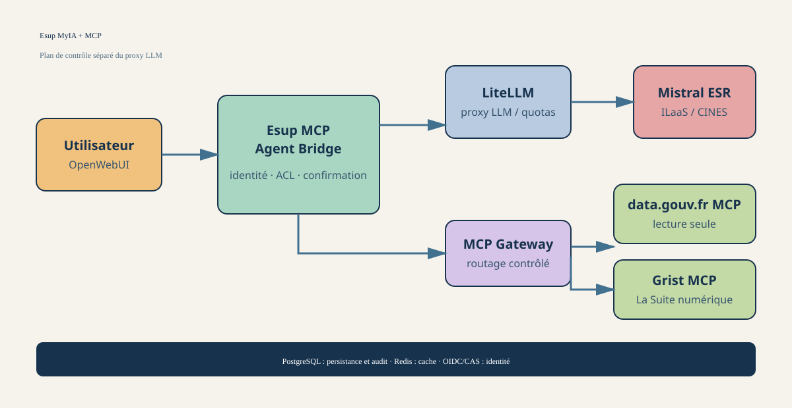
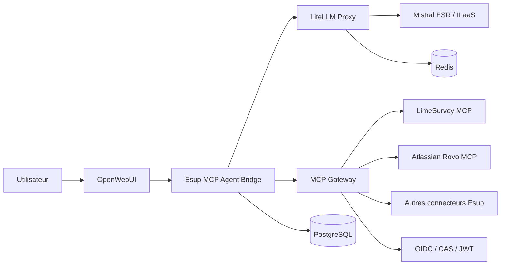
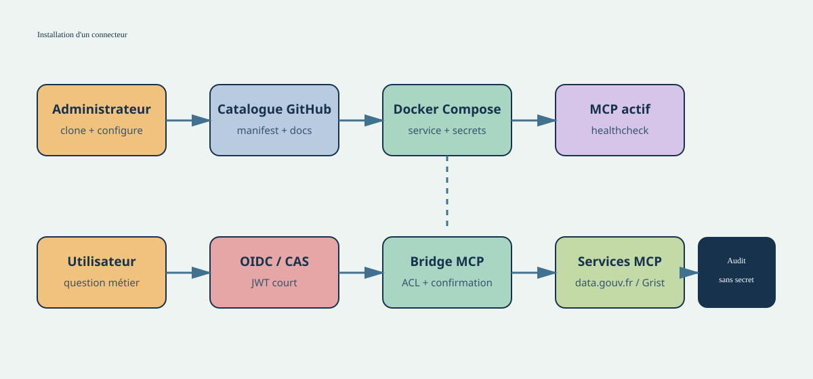

# Architecture MCP pour Esup MyIA Mistral AMUE

## Objet

Ce document propose une architecture permettant de partir du projet [Esup MyIA Mistral AMUE](https://github.com/EsupPortail/esup-myia-mistral-amue), d'installer un ou plusieurs connecteurs MCP depuis une bibliothèque GitHub Esup, de les configurer avec leurs secrets et d'exploiter un service auto-hébergé relié à Mistral ESR/ILaaS.

Le prototype prioritaire est le connecteur LimeSurvey fourni dans `mcp-limesurvey-master.zip`. Le connecteur Atlassian est proposé comme deuxième intégration, en tenant compte du fait que le serveur officiel Atlassian est un service distant.



## Principes directeurs

- **Séparer les responsabilités** : OpenWebUI présente l'interface, LiteLLM transporte les requêtes LLM et le plan MCP contrôle les outils.
- **Ne jamais exposer les secrets métier à OpenWebUI** ni au modèle.
- **Installer des versions immuables** des connecteurs, référencées par tag ou commit Git.
- **Appliquer le moindre privilège** : outils, utilisateurs, équipes, espaces et scopes doivent être explicitement autorisés.
- **Demander une confirmation humaine** avant toute écriture, import, modification ou suppression.
- **Documenter chaque connecteur** avec ses prérequis, secrets, scopes, risques et procédures de dépannage.
- **Conserver une installation Docker Compose simple** pour rester cohérent avec le dépôt MyIA actuel.

## Architecture cible



### Composants

| Composant | Responsabilité | Exposition recommandée |
|---|---|---|
| OpenWebUI | Interface, comptes, conversations | HTTPS uniquement |
| Esup MCP Agent Bridge | Boucle agentique, autorisations, confirmations, audit | Réseau interne ou HTTPS derrière reverse proxy |
| LiteLLM | Proxy OpenAI-compatible, quotas, cache, accès Mistral | Réseau interne ; administration restreinte |
| Mistral ESR/ILaaS | Inférence Mistral Medium ou modèle autorisé AMUE | Sortie HTTPS |
| MCP Gateway | Routage vers les serveurs MCP et filtrage | Réseau Docker privé |
| Connecteur MCP | Adaptateur d'un service métier | Réseau Docker privé ou endpoint distant |
| PostgreSQL | Données OpenWebUI, configuration et audit selon le choix retenu | Aucun port public |
| Redis | Cache et coordination | Aucun port public |
| OIDC/CAS | Identité utilisateur et émission/validation de jetons | Endpoint institutionnel |

LiteLLM dispose aussi de fonctions MCP (serveurs HTTP, SSE et `stdio`, permissions par clé/équipe/organisation, OAuth et appels depuis `chat/completions`). Elles peuvent être utilisées dans le bridge, mais les règles propres à Esup doivent rester dans le bridge ou dans un service d'administration dédié.

## Flux d'une conversation avec outil



1. L'utilisateur s'authentifie dans OpenWebUI avec l'identité institutionnelle.
2. OpenWebUI envoie la demande au bridge avec l'identité et le modèle demandé.
3. Le bridge calcule les connecteurs et outils autorisés pour cet utilisateur.
4. LiteLLM envoie le prompt et les définitions d'outils à Mistral ESR/ILaaS.
5. Mistral demande éventuellement un appel d'outil.
6. Le bridge vérifie le niveau de risque et demande une confirmation si nécessaire.
7. Le bridge appelle le serveur MCP avec un jeton utilisateur court ou une identité de service limitée.
8. Le serveur MCP vérifie l'identité puis appelle l'API métier.
9. Le résultat est renvoyé à Mistral, qui produit la réponse finale.
10. Le bridge journalise l'utilisateur, le connecteur, l'outil, le résultat de l'autorisation et la durée, sans enregistrer les secrets.

## Bibliothèque GitHub des connecteurs

Créer un dépôt tel que [EsupPortail/esup-mcp-catalog](https://github.com/EsupPortail) ou un dépôt par connecteur, selon la gouvernance souhaitée.

```text
esup-mcp-catalog/
├── catalog.yaml
├── connectors/
│   ├── limesurvey/
│   │   ├── manifest.yaml
│   │   ├── README.md
│   │   ├── docker-compose.fragment.yml
│   │   ├── .env.example
│   │   └── docs/
│   │       ├── installation.md
│   │       ├── configuration.md
│   │       ├── security.md
│   │       └── troubleshooting.md
│   └── atlassian/
│       ├── manifest.yaml
│       ├── README.md
│       └── docs/
├── schemas/connector-manifest.schema.json
└── scripts/{install-connector,validate-catalog,generate-compose}
```

### Manifeste standard

```yaml
id: limesurvey
version: 0.1.0
display_name: LimeSurvey
repository: https://github.com/EsupPortail/esup-mcp-limesurvey
image: ghcr.io/esupportail/mcp-limesurvey:0.1.0
transport: streamable-http
endpoint: http://mcp-limesurvey:8001/mcp

required_secrets:
  - LS_API_URL
  - LS_API_USER
  - LS_API_KEY

identity:
  mode: jwt
  required_claims: [sub]

risk:
  read_tools: [list_my_surveys, get_lss_generator_skill]
  write_tools: [import_my_survey]
  confirmation_required: [import_my_survey]

documentation:
  installation: docs/installation.md
  configuration: docs/configuration.md
  security: docs/security.md
  troubleshooting: docs/troubleshooting.md
```

Le manifeste sert à générer la configuration, vérifier les prérequis, demander les variables nécessaires, déclarer les outils et afficher la documentation adaptée.

## Expérience d'installation

Depuis un clone du projet MyIA :

```bash
git clone https://github.com/EsupPortail/esup-myia-mistral-amue.git
cd esup-myia-mistral-amue
cp .env.example .env

./bin/mcp catalog update
./bin/mcp install limesurvey --version 0.1.0
./bin/mcp configure limesurvey
./bin/mcp enable limesurvey

docker compose config
docker compose up -d
./bin/mcp doctor limesurvey
```

La commande `configure` doit demander les secrets directement dans le terminal, écrire un fichier local protégé ou utiliser les secrets Docker, puis lancer un test de connexion. Les secrets ne doivent pas être ajoutés au dépôt, aux logs ou aux prompts.

Commandes attendues :

| Commande | Fonction |
|---|---|
| `catalog update` | Récupérer un catalogue validé |
| `install <id>` | Installer un connecteur versionné |
| `configure <id>` | Définir les variables et secrets |
| `enable <id>` | Activer le service et ses règles |
| `disable <id>` | Désactiver sans supprimer les données |
| `doctor <id>` | Tester santé, MCP et API métier |
| `docs <id>` | Ouvrir la documentation du connecteur |
| `remove <id>` | Désinstaller après confirmation |

## Configuration Docker Compose

Le dépôt de référence fournit déjà PostgreSQL, Redis, LiteLLM et OpenWebUI. L'extension peut ajouter un bridge et les connecteurs activés :

```yaml
services:
  mcp-agent:
    image: ghcr.io/esupportail/esup-mcp-agent:0.1.0
    environment:
      LITELLM_BASE_URL: http://litellm:4000/v1
      LITELLM_API_KEY: ${LITELLM_MASTER_KEY}
      OIDC_ISSUER: ${OIDC_ISSUER}
      OIDC_AUDIENCE: ${OIDC_AUDIENCE}
      MCP_REGISTRY_PATH: /etc/esup-mcp/catalog.yaml
    volumes:
      - ./config/mcp:/etc/esup-mcp:ro
    depends_on:
      - litellm

  mcp-limesurvey:
    image: ghcr.io/esupportail/mcp-limesurvey:0.1.0
    environment:
      LS_API_URL: ${LS_API_URL}
      LS_API_USER: ${LS_API_USER}
      LS_API_KEY: ${LS_API_KEY}
      JWT_JWKS_URI: ${JWT_JWKS_URI}
      JWT_ISSUER: ${JWT_ISSUER}
      JWT_AUDIENCE: ${JWT_AUDIENCE}
    networks:
      - nw_llm
```

En production, les images doivent être épinglées par version et idéalement par digest. Aucun port de connecteur ne doit être publié sur Internet ; seul le reverse proxy de l'interface doit être public.

## Prototype LimeSurvey

Le ZIP fourni contient déjà une base exploitable :

- serveur FastMCP Python ;
- transport Streamable HTTP ;
- endpoint `/mcp` ;
- route `/health` ;
- client LimeSurvey Remote Control API ;
- validation JWT/JWKS ;
- tests `pytest` ;
- gestion documentée de `LS_API_URL`, `LS_API_USER` et `LS_API_KEY` ;
- skill `lss-generator` pour produire des fichiers `.lss`.

Outils actuels :

| Outil | Nature | Décision |
|---|---|---|
| `list_my_surveys` | Lecture | Autorisé automatiquement après contrôle d'identité |
| `get_lss_generator_skill` | Lecture/documentation | Autorisé automatiquement |
| `import_my_survey` | Écriture | Confirmation humaine obligatoire |

Le serveur LimeSurvey doit être adapté pour supprimer le mode sans authentification en production, vérifier les claims `iss`, `aud`, `sub`, limiter la taille des fichiers importés et filtrer les erreurs de l'API avant journalisation.

## Connecteur Atlassian

Le serveur officiel Atlassian est le serveur distant suivant :

```text
https://mcp.atlassian.com/v2/mcp
```

Il donne accès, selon les autorisations, à Jira, Confluence, Jira Service Management, Bitbucket, Compass, Loom et d'autres fonctions Atlassian.

### Authentification

- **OAuth 2.1 par utilisateur** : option recommandée pour conserver les droits individuels.
- **API token ou clé de compte de service** : adapté aux traitements sans interaction, mais à limiter à un périmètre minimal.

Le catalogue doit déclarer les scopes, produits et outils réellement nécessaires. Les outils de suppression et d'administration restent désactivés par défaut. Il faut utiliser `/v2/mcp`, et non l'ancien endpoint SSE `/v1/sse`.

Cette intégration est auto-hébergée du point de vue de MyIA, mais le serveur MCP Atlassian reste opéré par Atlassian. Une future implémentation locale pourrait être ajoutée si les contraintes de souveraineté l'exigent.

## Sécurité et gouvernance

### Contrôles minimum

- TLS sur l'interface et les endpoints externes ;
- OIDC/CAS et JWT courts ;
- secrets Docker, Vault ou secret manager institutionnel ;
- rotation et révocation documentées ;
- ACL par utilisateur, groupe et connecteur ;
- confirmation avant toute écriture ;
- timeouts et limite du nombre d'appels par tour ;
- limite de taille des résultats et des fichiers ;
- allowlist des destinations réseau ;
- logs d'audit sans contenu sensible ;
- sauvegardes chiffrées de PostgreSQL ;
- images et dépendances scannées avant publication.

### Risques MCP à traiter

Les descriptions d'outils et les données retournées par un service externe sont des entrées non fiables. Le bridge doit donc résister à l'injection indirecte, au tool poisoning et aux tentatives d'exfiltration. Une description d'outil ne doit jamais pouvoir désactiver une règle d'autorisation ou une confirmation.

## Documentation de chaque connecteur

Chaque connecteur doit livrer quatre pages :

1. `installation.md` : prérequis, version, Docker, ports et rollback ;
2. `configuration.md` : variables, création des clés, scopes et test ;
3. `security.md` : données accessibles, identité, risques, rotation et révocation ;
4. `troubleshooting.md` : healthcheck, MCP Inspector, logs et erreurs fréquentes.

La documentation doit être publiée avec la même version que l'image et le manifeste.

## Feuille de route

### Phase 1 : socle

- créer `esup-mcp-agent` ;
- exposer une API OpenAI-compatible ;
- intégrer LiteLLM et le client MCP Streamable HTTP ;
- implémenter la boucle outil/réponse ;
- ajouter autorisations, confirmations, healthchecks et audit.

### Phase 2 : LimeSurvey

- produire une image versionnée à partir du ZIP ;
- ajouter le manifeste et le fragment Compose ;
- intégrer OIDC/JWKS institutionnel ;
- tester `list_my_surveys` et `import_my_survey` ;
- publier la documentation complète.

### Phase 3 : catalogue et administration

- valider les manifestes avec un JSON Schema ;
- signer ou verrouiller le catalogue ;
- générer la configuration LiteLLM et du bridge ;
- gérer les permissions par équipe ;
- ajouter les commandes `install`, `configure`, `enable`, `disable`, `doctor` et `remove`.

### Phase 4 : Atlassian

- intégrer `/v2/mcp` ;
- tester OAuth 2.1 et le mode compte de service ;
- filtrer les outils par groupe ;
- auditer les actions Jira et Confluence ;
- documenter les scopes et la révocation.

## Décision recommandée

Le premier incrément doit être :

```text
OpenWebUI -> esup-mcp-agent -> LiteLLM -> Mistral ESR/ILaaS
                         \-> MCP LimeSurvey
```

Cette trajectoire réutilise le Compose existant, exploite le prototype déjà disponible et permet de valider l'identité, la confirmation des écritures, le catalogue GitHub et la boucle MCP avant d'ajouter un fournisseur distant comme Atlassian.

## Références

- [Esup MyIA Mistral AMUE](https://github.com/EsupPortail/esup-myia-mistral-amue)
- [Atlassian Rovo MCP Server](https://github.com/atlassian/atlassian-mcp-server)
- [Documentation LiteLLM MCP](https://docs.litellm.ai/docs/mcp)
- [Spécification Model Context Protocol](https://modelcontextprotocol.io/)
- Prototype local : `mcp-limesurvey-master.zip`