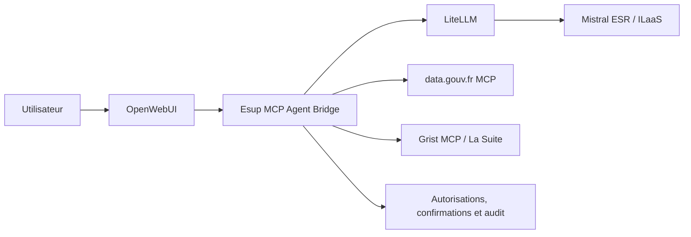

# POC MCP pour Esup MyIA

Ce dépôt documente le raccordement d'Esup MyIA Mistral AMUE à deux serveurs MCP existants :

- [data.gouv.fr MCP](https://github.com/datagouv/datagouv-mcp), serveur public de consultation des données et ressources data.gouv.fr ;
- [Grist MCP](https://github.com/nic01asFr/mcp-server-grist), connecteur Grist utilisé pour les besoins de La Suite numérique.

Le code de ces serveurs reste externe à ce dépôt.

## Projet communautaire

Ce POC s'inscrit dans un projet de magasin mutualisé de serveurs MCP pour l'ESR/Esup, adossé à `esup-myia-mistral-amue`. L'objectif est d'éviter que chaque établissement réimplémente les mêmes connecteurs et de permettre à un assistant IA souverain d'agir dans les outils métiers de son écosystème.

Un serveur MCP est la couche d'intégration qui transforme une API existante en outils utilisables par un agent en langage naturel. À terme, le même catalogue pourra servir MyIA/OpenWebUI et d'autres clients MCP, avec des scénarios composés entre plusieurs applications. Chaque établissement restera maître des connecteurs qu'il active, des comptes de service utilisés et des autorisations accordées.

Le projet vise des composants open source et souverains de l'ESR, de La Suite numérique et des communs numériques de l'État. Le catalogue doit privilégier les applications disposant d'une API mature et d'une valeur d'usage claire, tout en écartant les intégrations dont le risque ou la sensibilité est disproportionné.

## Comment lire ce document

Ce document s'adresse d'abord aux personnes qui connaissent les usages de MyIA et les applications de l'ESR, sans nécessairement développer des logiciels. Les exemples techniques servent à montrer comment un connecteur est installé et protégé ; ils ne sont pas nécessaires pour comprendre le projet. Les mots spécialisés sont définis dans le [glossaire](#glossaire).

## Architecture



Le bridge conserve les règles d'accès, les confirmations humaines et l'audit. Les secrets ne doivent jamais être envoyés à OpenWebUI, au modèle, dans les logs ou dans Git.

## Serveurs MCP du POC

Le POC teste deux façons d'ajouter une capacité à l'assistant : consulter des données publiques avec data.gouv.fr et travailler avec des données structurées dans Grist. Le premier serveur est déjà hébergé ; le second doit être configuré avec l'instance Grist de l'établissement.

### data.gouv.fr

- Dépôt : `https://github.com/datagouv/datagouv-mcp`
- Instance publique : `https://mcp.data.gouv.fr/mcp`
- Transport : Streamable HTTP uniquement
- Authentification de l'instance publique : aucune clé requise
- Nature : lecture seule
- Variables d'un déploiement local : `MCP_HOST`, `MCP_PORT`, `DATAGOUV_API_ENV`, `LOG_LEVEL`

Les outils permettent notamment de rechercher des jeux de données, des organismes et des services, puis de consulter leurs informations et leurs ressources. Ils sont en lecture seule. Les résultats provenant d'Internet doivent être considérés comme des informations à vérifier, et non comme des instructions à suivre.

Configuration de référence pour un client MCP HTTP :

```json
{
  "url": "https://mcp.data.gouv.fr/mcp",
  "type": "http"
}
```

### Grist / La Suite numérique

- Dépôt : `https://github.com/nic01asFr/mcp-server-grist`
- Transports documentés : STDIO et Streamable HTTP ; SSE est déprécié
- Secret obligatoire : `GRIST_API_KEY`
- Variable optionnelle : `GRIST_API_URL`
- Valeur par défaut documentée : `https://docs.getgrist.com/api`
- HTTP local documenté : `127.0.0.1:8000/mcp`

Le serveur permet de parcourir les espaces et documents, consulter ou interroger des données, et, selon les droits accordés, créer ou modifier des éléments. Toute création, modification, suppression, import ou requête avancée doit faire l'objet d'une autorisation et d'une confirmation adaptées.

Exemple STDIO avec `uvx` :

```json
{
  "command": "uvx",
  "args": ["mcp-server-grist"],
  "env": {
    "GRIST_API_KEY": "${GRIST_API_KEY}",
    "GRIST_API_URL": "https://docs.getgrist.com/api"
  }
}
```

Ne remplacez jamais `${GRIST_API_KEY}` par une valeur réelle dans un fichier versionné.

## Périmètre et évolutions

Le POC se limite à data.gouv.fr et Grist. D'autres connecteurs pourront être étudiés ultérieurement selon la maturité de leur API, leur utilité pour l'ESR, leur maintenabilité et le niveau de risque associé.

Les applications manipulant des données sensibles nécessiteront une analyse RGPD et sécurité dédiée avant toute intégration. Les fonctions d'authentification multifacteur et les envois massifs ne font pas partie des usages visés.

Le catalogue n'est pas une liste d'intégrations disponibles : chaque connecteur devra être évalué, documenté, versionné et validé avant d'être proposé aux établissements.

## Configuration MyIA

Le bridge peut enregistrer les deux serveurs dans son catalogue :

```yaml
servers:
  datagouv:
    repository: https://github.com/datagouv/datagouv-mcp
    transport: streamable-http
    url: https://mcp.data.gouv.fr/mcp
    read_only: true
  grist:
    repository: https://github.com/nic01asFr/mcp-server-grist
    transport: stdio
    command: uvx
    args: [mcp-server-grist]
    env:
      GRIST_API_KEY: ${GRIST_API_KEY}
      GRIST_API_URL: ${GRIST_API_URL:-https://docs.getgrist.com/api}
    confirmation_required: all_mutations
```

En production, épinglez les versions ou commits des dépendances, utilisez un gestionnaire de secrets et limitez les destinations réseau. Pour le mode HTTP, utilisez `127.0.0.1` en local et un reverse proxy HTTPS avec contrôle d'origine en exposition distante.

## Déploiement cible

Chaque connecteur a vocation à être un conteneur Docker autonome, déclaré comme service optionnel de la stack MyIA. Son activation suit un parcours commun :

1. choisir les connecteurs utiles parmi le catalogue ;
2. déclarer l'adresse de l'application et les secrets dans la configuration locale de l'établissement ;
3. activer l'outil dans l'administration MyIA/OpenWebUI ;
4. vérifier les permissions, le healthcheck et l'audit avant ouverture aux utilisateurs.

L'utilisateur final ne configure pas les connecteurs. Le bridge et la couche d'administration portent les règles d'accès, les confirmations avant écriture et la journalisation sans contenu sensible.

## Gouvernance et maintenance

Le catalogue a vocation à être communautaire. Chaque module devra documenter ses prérequis, ses permissions, ses versions d'API et ses limites, puis faire l'objet d'une revue avant d'être recommandé. Les modules développés dans le cadre Esup suivront la licence retenue par la communauté ; les licences des serveurs et dépendances externes restent à vérifier séparément.

## Vérifications du POC

1. Vérifier la connexion à `https://mcp.data.gouv.fr/mcp` et appeler uniquement un outil de lecture.
2. Configurer Grist avec une clé dédiée et tester d'abord `list_organizations`, `list_workspaces` et `list_documents`.
3. Vérifier que les opérations Grist mutantes sont bloquées sans confirmation explicite.
4. Vérifier que les clés et les réponses sensibles n'apparaissent ni dans les logs ni dans les commits.

## Feuille de route

- ajouter le catalogue validé au bridge ;
- définir le manifeste, le label de compatibilité et le processus de revue communautaire ;
- intégrer les permissions par utilisateur et groupe ;
- limiter les outils Grist exposés selon le profil ;
- ajouter healthchecks, timeouts, limites de résultats et audit ;
- tester la configuration Docker et les connexions MCP sans secret réel ;
- évaluer progressivement les candidats du catalogue selon leur API et leur niveau de risque.

## Glossaire

- **API** : interface proposée par une application pour permettre à un autre logiciel de lui demander des informations ou de lui faire effectuer une action.
- **Assistant IA** : logiciel qui comprend une demande en langage naturel et peut, lorsque cela est autorisé, utiliser des outils externes pour y répondre.
- **MCP** (*Model Context Protocol*) : protocole ouvert qui décrit la manière de présenter des outils et des données à un assistant IA.
- **Serveur MCP** : connecteur qui traduit les demandes de l'assistant en appels compréhensibles par une application, et qui renvoie les résultats à l'assistant.
- **Connecteur** : autre nom donné à un serveur MCP lorsqu'on insiste sur son rôle de liaison avec une application.
- **Bridge** : composant intermédiaire qui choisit les connecteurs utilisables, vérifie les droits et demande une confirmation avant une action sensible.
- **Endpoint** : adresse précise à laquelle un service est joignable, par exemple `https://mcp.data.gouv.fr/mcp`.
- **Transport** : manière dont le client et le serveur échangent leurs messages. `Streamable HTTP` utilise une connexion web ; `STDIO` utilise les entrées et sorties d'un programme lancé localement.
- **LiteLLM** : composant qui relaie les demandes entre MyIA et le modèle Mistral, et qui peut aussi déclarer des serveurs MCP.
- **OpenWebUI** : interface web utilisée par MyIA pour dialoguer avec l'assistant.
- **ILaaS** : service de l'AMUE donnant accès aux modèles Mistral pour l'enseignement supérieur et la recherche.
- **Secret** : information confidentielle, comme une clé d'accès, qui doit rester dans la configuration locale ou un coffre de secrets.
- **Healthcheck** : vérification automatique indiquant qu'un service répond correctement.
- **RGPD** : règlement européen qui encadre la collecte, l'utilisation et la protection des données personnelles.
- **Lecture seule** : capacité de consulter des informations sans pouvoir les créer, modifier ou supprimer.

## Références

- [Esup MyIA Mistral AMUE](https://github.com/EsupPortail/esup-myia-mistral-amue)
- [Documentation LiteLLM MCP](https://docs.litellm.ai/docs/mcp)
- [Spécification Model Context Protocol](https://modelcontextprotocol.io/)
